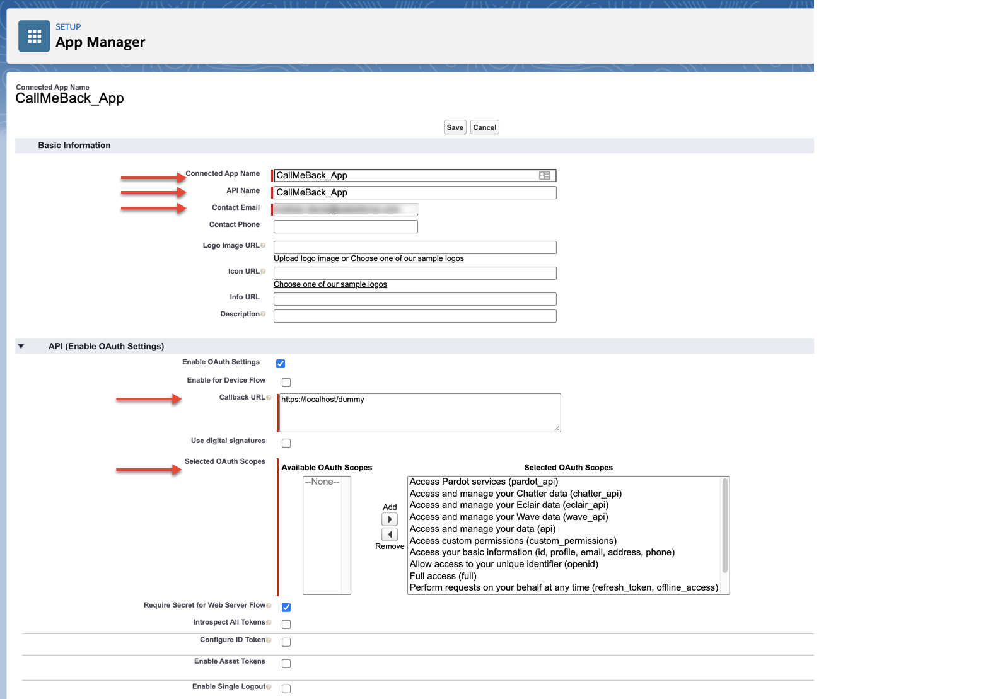
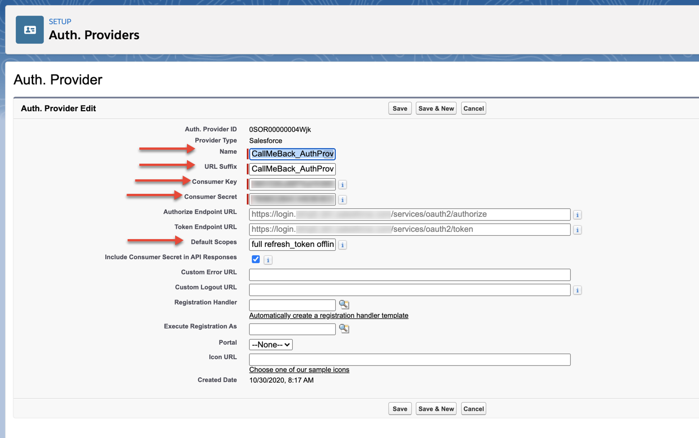
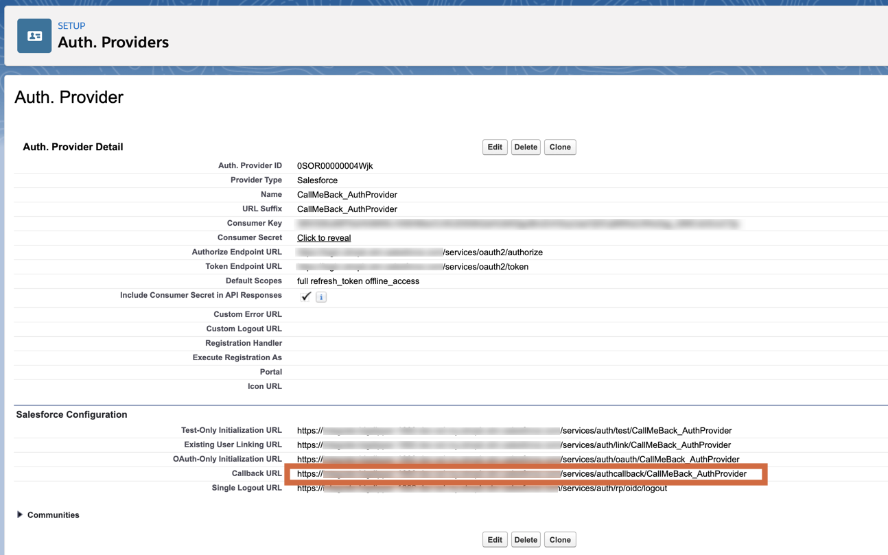
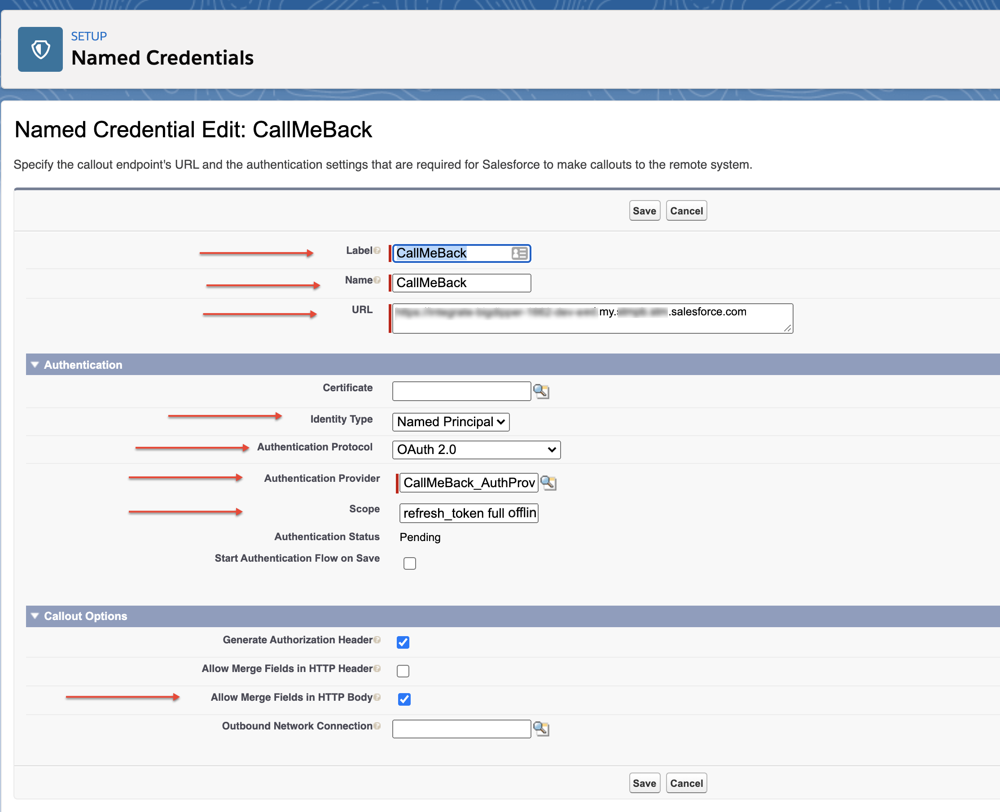
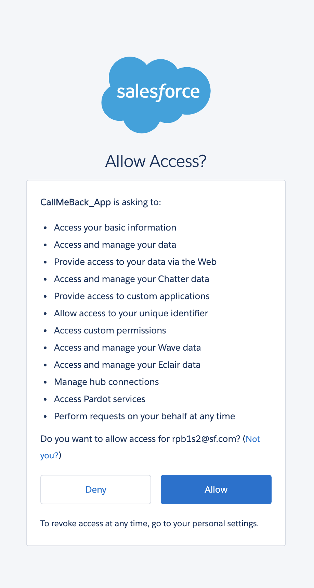

# Using Named Credentials for calling REST from Apex

## Problem:

When you call the Salesforce REST API from a Lightning Apex session the API returns an HTTP 500 error stating **INVALID_SESSION_ID**. This is due to the Lightning Apex Sessions not being APi-enabled.

```
HttpRequest httpRequest = new HttpRequest();
Object response;

String baseUrl = URL.getOrgDomainUrl().toExternalForm();
String apiUrl = '/services/data/v50.0/commerce/webstores/' + webstoreId + '/search/product-search';
httpRequest.setMethod('POST');
httpRequest.setEndpoint(baseUrl + apiUrl);
httpRequest.setHeader('Content-Type', 'application/json');
httpRequest.setHeader('Authorization', 'OAuth ' + UserInfo.getSessionId());

httpRequest.setBody(searchQuery);

try {
    Http http = new Http();
    HttpResponse httpResponse = http.send(httpRequest);
    Integer statusCode = httpResponse.getStatusCode();

    if (statusCode >= 200 && statusCode <= 204) {
        response = JSON.deserializeUntyped(httpResponse.getBody());
    } else {
        System.debug(' httpResponse ' + httpResponse.getBody());
        throw new CalloutException(httpResponse.getBody());
    }
} catch (System.Exception e) {
    System.debug('ERROR: ' + e);
    throw e;
}

return response;

```

```
{
    exceptionType: "System.CalloutException",
    isUserDefinedException: false,
    message: [
        {
            message: "Session expired or invalid",
            errorCode: "INVALID_SESSION_ID"
        }]
}
```

The cause and workaround are documented [here](https://developer.salesforce.com/docs/atlas.en-us.lightning.meta/lightning/apex_api_calls.htm), stating:

> By security policy, sessions created by Lightning components aren’t enabled for API access. This prevents even your Apex code from making API calls to Salesforce. Using a named credential for specific API calls allows you to carefully and selectively bypass this security restriction.

> **The restrictions on API-enabled sessions aren’t accidental. Carefully review any code that uses a named credential to ensure you’re not creating a vulnerability.**

## Solution: Named Credentials

There are 3 steps involved to create a named credential:

1. Create a Connected App
2. Create an Auth Provider
3. Create a Named Credential

### 1. Create a Connected App

-   Setup → Apps → App Manager, click the “New Connected App” button
-   Enter the following details, noting that the _Callback URL_ is “https://localhost/dummy” for now - this will be changed in a subsequent step, so we recommend keeping this tab open and performing the next step in a different tab.

-   
-   Press Save
-   Make a note of the Consumer Key and Secret (we will need this later)
-   

### 2. Create an Auth Provider

-   Open Setup in another tab and go to Identity → Auth Providers and press “New”
-   Select Provider Type “Salesforce”
-   Give your Auth Provider a name and paste the Consumer Key and Secret from your Connected App
-   Enter the scopes: full refresh_token offline_access

-   
-   Save
-   
-   Copy the Callback URL, go to the Connected App tab that you kept open, and enter this URL (replacing the dummy url https://localhost/dummy)
-   

### 3. Create a Named Credential

-   Setup → Security → Named Credentials
-   Enter the details as shown in the image below
-   Note:

    -   The URL that you are entering here is the hostname part of the _Callback URL_. (i.e. paste the _Callback URL_ and remove the part starts with "services/authcallback/CallMeBack_AuthProvider")
    -   In the "Scope" field, enter: refresh_token offline_access
    -   Make sure to check “Allow Merge Fields in HTTP Body”

-   
-   Clear the checkbox “Start Authentication Flow on Save” and click save the changes.
-   Click Edit, **make sure the checkbox is checked** and save again. (Why did I not set the checkbox the first time? Because if you make some mistakes saving this you’ll have to restart the form!)
-   After saving, the user will be redirected to login. When you log back in, you will get the following message, press the allow button
    -   Important Note: If you are using a scratch org created by SFDX you may not know the password of your org. Since the Named Credential’s re-login step will require the password, you'll need to reset the password by going to Setup -> Users and reset your password (make sure you are using the right email)
-   

## Using the Callback in Apex

Now we are ready to use the named credentials! The base URL becomes callout:CallMeBack (callout:`<Name of the Named Credential>`) and we no longer need `setHeader()` with Authorization.

```
      // httpRequest.setMethod('POST');
      // httpRequest.setHeader('Content-Type', 'application/json');
      // httpRequest.setHeader('Authorization', 'OAuth ' + UserInfo.getSessionId());

      // String baseUrl = URL.getOrgDomainUrl().toExternalForm();
      // String apiUrl = '/services/data/v50.0/commerce/webstores/' + webstoreId + '/search/product-search';
      // httpRequest.setEndpoint(baseUrl + apiUrl);

      httpRequest.setMethod('POST');
      httpRequest.setHeader('Content-Type', 'application/json;  charset=utf-8');
      httpRequest.setEndpoint(
          'callout:CallMeBack/services/data/v50.0/commerce/webstores/' +
          webstoreId + '/search/product-search');
```
